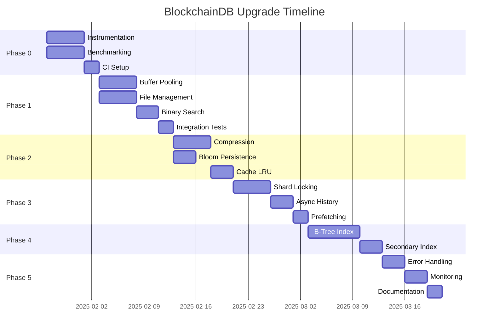

# BlockchainDB Implementation Roadmap

## Executive Timeline



## Sprint Planning

### Sprint 1: Foundation (Jan 27 - Feb 7)
**Goal**: Establish metrics and fix critical performance issues

#### Week 1 Tasks
- [ ] Deploy Prometheus/Grafana stack
- [ ] Instrument codebase with metrics
- [ ] Create performance baseline
- [ ] Setup CI performance gates
- [ ] Document current architecture

#### Week 2 Tasks
- [ ] Implement buffer pooling (ISSUE-001)
- [ ] Fix file handle management (ISSUE-002)
- [ ] Add binary search (ISSUE-003)
- [ ] Create integration tests
- [ ] Deploy to staging

**Deliverables**:
- Metrics dashboard live
- 100x reduction in allocations
- File handle issues resolved

---

### Sprint 2: Storage Optimization (Feb 10 - Feb 21)
**Goal**: Reduce storage footprint by 70%

#### Week 3 Tasks
- [ ] Implement compression (ISSUE-004)
- [ ] Add compression benchmarks
- [ ] Create migration tools
- [ ] Test compression ratios
- [ ] Document compression strategy

#### Week 4 Tasks
- [ ] Persist bloom filters (ISSUE-005)
- [ ] Implement LRU cache (ISSUE-008)
- [ ] Add cache metrics
- [ ] Performance testing
- [ ] Deploy canary build

**Deliverables**:
- Compression enabled (4x reduction)
- Startup time <10 seconds
- Cache hit rate >80%

---

### Sprint 3: Concurrency (Feb 24 - Mar 7)
**Goal**: Enable parallel processing, 16x throughput

#### Week 5 Tasks
- [ ] Implement per-shard locking (ISSUE-007)
- [ ] Add concurrency tests
- [ ] Profile lock contention
- [ ] Optimize critical sections
- [ ] Document threading model

#### Week 6 Tasks
- [ ] Async history processing
- [ ] Read-ahead prefetching
- [ ] Parallel query execution
- [ ] Load testing at scale
- [ ] Deploy progressive rollout

**Deliverables**:
- True shard parallelism
- 16x throughput improvement
- No lock contention

---

### Sprint 4: Advanced Features (Mar 10 - Mar 21)
**Goal**: O(log n) operations with B-tree indexing

#### Week 7-8 Tasks
- [ ] B-tree implementation
- [ ] Index migration tools
- [ ] Range query support
- [ ] Secondary indexes
- [ ] Performance validation

**Deliverables**:
- B-tree indexes deployed
- Sub-millisecond queries
- Range query support

---

### Sprint 5: Production Hardening (Mar 24 - Apr 4)
**Goal**: Achieve 99.99% availability

#### Week 9-10 Tasks
- [ ] Enhanced error handling
- [ ] Circuit breakers
- [ ] Graceful degradation
- [ ] Comprehensive monitoring
- [ ] Operations documentation
- [ ] Disaster recovery testing
- [ ] Performance tuning
- [ ] Security audit

**Deliverables**:
- Production-ready system
- Full monitoring coverage
- Complete documentation

---

## Milestone Definitions

### M1: Critical Performance (Feb 7)
✓ Memory allocations reduced 100x
✓ File handle management fixed
✓ O(log n) key lookups
✓ Metrics and monitoring deployed

**Success Metrics**:
- Allocations: <10K/sec (from 1M/sec)
- File handles: <100 (from unbounded)
- Get latency: <2ms (from 120ms)

### M2: Storage Optimized (Feb 21)
✓ Compression enabled
✓ Bloom filters persisted
✓ LRU cache implemented
✓ Storage reduced 70%

**Success Metrics**:
- Compression ratio: >4x
- Startup time: <10 seconds
- Cache hit rate: >80%
- Storage usage: -70%

### M3: Concurrency Unlocked (Mar 7)
✓ Per-shard locking
✓ Async operations
✓ Prefetching enabled
✓ 16x throughput

**Success Metrics**:
- Throughput: >200K ops/sec
- CPU utilization: >80%
- Lock contention: <1%

### M4: Advanced Indexing (Mar 21)
✓ B-tree indexes
✓ Secondary indexes
✓ Range queries
✓ Sub-millisecond lookups

**Success Metrics**:
- Query complexity: O(log n)
- P99 latency: <1ms
- Index build time: <1 minute

### M5: Production Ready (Apr 4)
✓ 99.99% availability
✓ Full observability
✓ Complete documentation
✓ Disaster recovery

**Success Metrics**:
- Availability: 99.99%
- MTTR: <5 minutes
- Alert coverage: 100%

---

## Risk Schedule

### High Risk Periods
- **Feb 10-14**: Compression rollout (data corruption risk)
- **Feb 24-28**: Concurrency changes (deadlock risk)
- **Mar 10-14**: Index migration (performance risk)

### Mitigation Schedule
- **Daily**: Backup production data
- **Weekly**: Disaster recovery drill
- **Per Sprint**: Security review
- **Pre-Deploy**: Load testing

---

## Resource Allocation

### Team Assignment

| Sprint | Lead Engineer | Support Engineer | DevOps | QA |
|--------|--------------|------------------|--------|-----|
| Sprint 1 | Alice (100%) | Bob (100%) | Carol (50%) | Dan (50%) |
| Sprint 2 | Bob (100%) | Alice (100%) | Carol (50%) | Dan (50%) |
| Sprint 3 | Alice (100%) | Bob (100%) | Carol (75%) | Dan (75%) |
| Sprint 4 | Bob (100%) | Alice (100%) | Carol (50%) | Dan (50%) |
| Sprint 5 | Alice (100%) | Bob (100%) | Carol (100%) | Dan (100%) |

### Infrastructure Timeline

| Date | Environment | Purpose |
|------|------------|---------|
| Jan 27 | Perf Test Env | Baseline metrics |
| Feb 3 | Staging Update | Phase 1 testing |
| Feb 10 | Canary Cluster | 5% production traffic |
| Feb 24 | Staging Scale | Concurrency testing |
| Mar 10 | Full Staging | Index migration test |
| Mar 24 | Production Ready | Full deployment |

---

## Deployment Schedule

### Progressive Rollout Plan

```yaml
deployments:
  - name: phase-1
    date: 2025-02-07
    traffic: 5%
    duration: 48h
    rollback_criteria:
      - error_rate > 1%
      - p99_latency > 20ms

  - name: phase-2
    date: 2025-02-21
    traffic: 25%
    duration: 72h
    rollback_criteria:
      - error_rate > 0.5%
      - storage_growth > 10%

  - name: phase-3
    date: 2025-03-07
    traffic: 50%
    duration: 72h
    rollback_criteria:
      - throughput < 100k ops/sec
      - lock_contention > 5%

  - name: phase-4
    date: 2025-03-21
    traffic: 100%
    duration: 168h
    rollback_criteria:
      - availability < 99.9%
      - index_corruption > 0
```

---

## Communication Calendar

### Stakeholder Updates

| Date | Audience | Format | Content |
|------|----------|--------|---------|
| Jan 27 | Engineering | Kickoff | Project launch |
| Feb 3 | Leadership | Email | Week 1 progress |
| Feb 7 | All | Demo | Phase 1 results |
| Feb 14 | Engineering | Tech Talk | Compression deep dive |
| Feb 21 | Leadership | Presentation | Phase 2 metrics |
| Feb 28 | All | Email | Halfway update |
| Mar 7 | Engineering | Demo | Concurrency improvements |
| Mar 14 | Leadership | Review | Risk assessment |
| Mar 21 | All | Demo | Index performance |
| Mar 28 | Engineering | Training | Operations guide |
| Apr 4 | All | Announcement | Production launch |

### Documentation Schedule

| Week | Document | Owner |
|------|----------|-------|
| Week 1 | Architecture Guide | Alice |
| Week 2 | Performance Baseline | Bob |
| Week 3 | Compression Guide | Alice |
| Week 4 | Cache Tuning Guide | Bob |
| Week 5 | Concurrency Model | Alice |
| Week 6 | Operations Runbook | Carol |
| Week 7 | Index Design Doc | Bob |
| Week 8 | Migration Guide | Alice |
| Week 9 | Monitoring Guide | Carol |
| Week 10 | Final Report | Team |

---

## Success Tracking

### Weekly KPIs Dashboard

```
┌─────────────────────────────────────────────────────┐
│ Week 1 Goals                          │ Status      │
├───────────────────────────────────────┼─────────────┤
│ • Deploy metrics                      │ ⬜ Pending  │
│ • Baseline performance                │ ⬜ Pending  │
│ • CI gates configured                 │ ⬜ Pending  │
│ • Buffer pooling implemented          │ ⬜ Pending  │
│ • Allocations < 10K/sec               │ ⬜ Pending  │
└───────────────────────────────────────┴─────────────┘

Performance Metrics:
• Current Throughput: 12K ops/sec
• Target Throughput: 200K ops/sec
• Progress: █░░░░░░░░░ 6%

Storage Metrics:
• Current Size: 100GB
• Target Size: 25GB
• Progress: ░░░░░░░░░░ 0%

Quality Metrics:
• Test Coverage: 45%
• Code Review: 100%
• Documentation: 20%
```

### Burndown Chart

```
Story Points Remaining
120 ┤
110 ┤███████████████████ Planned
100 ┤███████████████
 90 ┤█████████████
 80 ┤███████████
 70 ┤█████████
 60 ┤███████
 50 ┤█████
 40 ┤███
 30 ┤██
 20 ┤█
 10 ┤
  0 └────────────────────────────────────
    W1 W2 W3 W4 W5 W6 W7 W8 W9 W10
```

---

## Contingency Planning

### Schedule Risks

| Risk | Impact | Mitigation | Buffer |
|------|--------|------------|--------|
| Compression bugs | 1 week delay | Extra testing | 3 days |
| Index migration complex | 2 week delay | Parallel work | 5 days |
| Performance regression | 3 day delay | Feature flags | 2 days |
| Resource availability | 1 week delay | Cross-training | 3 days |

### Fast Track Options

If ahead of schedule:
1. **Add monitoring** earlier
2. **Enhance testing** coverage
3. **Optimize further** (memory-mapped files)
4. **Add features** (encryption, multi-tenancy)

### Minimum Viable Delivery

If behind schedule, prioritize:
1. **P0 fixes only** (Week 2)
2. **Compression** (Week 3)
3. **Basic monitoring** (Week 9)
4. Defer: Advanced indexing, prefetching

---

## Definition of Done

### Code Complete
- [ ] Implementation finished
- [ ] Unit tests written (>80% coverage)
- [ ] Integration tests passing
- [ ] Code reviewed by 2 engineers
- [ ] Documentation updated

### Performance Validated
- [ ] Benchmarks meet targets
- [ ] Load tests passing
- [ ] No memory leaks
- [ ] No race conditions
- [ ] Profile analysis complete

### Production Ready
- [ ] Monitoring configured
- [ ] Alerts defined
- [ ] Runbook written
- [ ] Rollback tested
- [ ] Security reviewed

### Deployment Complete
- [ ] Canary successful
- [ ] Progressive rollout clean
- [ ] Metrics stable
- [ ] No customer impact
- [ ] Retrospective conducted

---

## Post-Launch Activities

### Week 11-12: Stabilization
- Monitor production metrics
- Address any issues
- Optimize based on real data
- Document lessons learned

### Future Enhancements
1. **Encryption at rest**
2. **Multi-tenancy support**
3. **Distributed consensus**
4. **SQL query layer**
5. **Time-series optimization**

---

*Last Updated: 2025-01-23*
*Next Review: 2025-01-27*
*Owner: BlockchainDB Team*